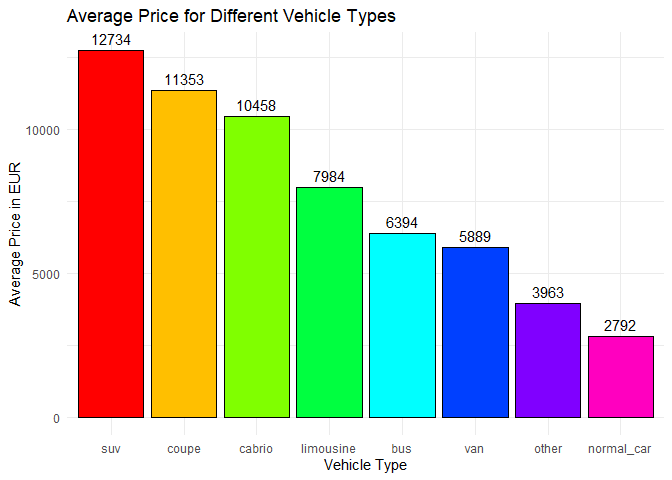
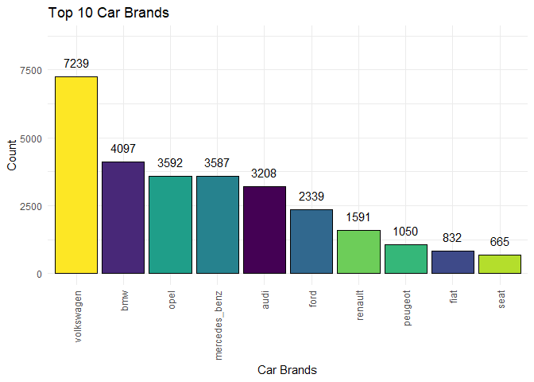
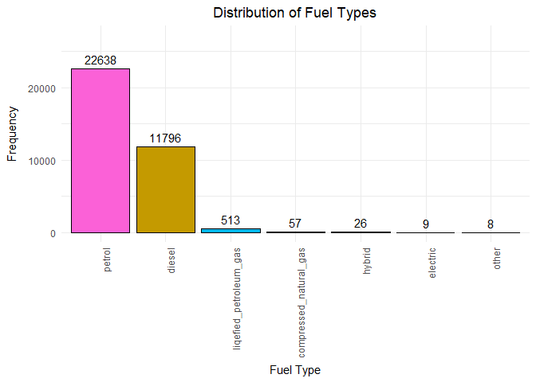

Visual Analysis of Used Cars Dataset
================
Dominik Vukelic

# Creating a pie chart with percentages for gearbox type

<!-- -->

# Creating a bar chart with different colors for the distribution of vehicle types

<!-- -->

# Creating a grouped bar chart for the relationship between vehicleType and gearbox

<!-- -->

# Creating a grouped bar chart for the relationship between powerPS and vehicleType

<!-- -->

# Plot the bar chart for Average Price for Different Vehicle Types

<!-- -->

# Plot a horizontal bar chart for the top 10 car brands

<!-- -->

# Box plot: Price Distribution by Fuel Type

<!-- -->

# Scatter Plot: Price vs. Mileage

<!-- -->

# Plot a bar chart with different colors for the distribution of Fuel types

<!-- -->
